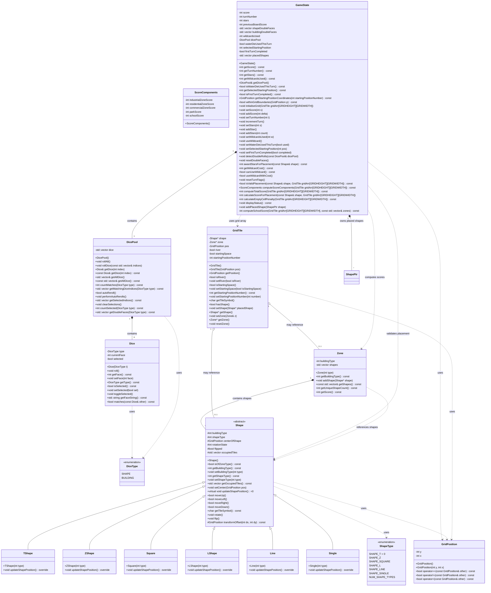

```mermaid
classDiagram
    %% Structs
    class ScoreComponents {
        -int industrialZoneScore
        -int residentialZoneScore
        -int commercialZoneScore
        -int parkScore
        -int schoolScore
        +ScoreComponents()
    }

    class GridPosition {
        -int y
        -int x
        +GridPosition()
        +GridPosition(int y, int x)
        +bool operator==(const GridPosition& other) const
        +bool operator!=(const GridPosition& other) const
        +bool operator<(const GridPosition& other) const
    }

    %% Enums
    class ShapeType {
        <<enumeration>>
        SHAPE_T = 0
        SHAPE_Z
        SHAPE_SQUARE
        SHAPE_L
        SHAPE_LINE
        SHAPE_SINGLE
        NUM_SHAPE_TYPES
    }

    class DiceType {
        <<enumeration>>
        SHAPE
        BUILDING
    }

    %% Abstract Base Class
    class Shape {
        <<abstract>>
        #int buildingType
        #int shapeType
        #GridPosition centerOfShape
        #int rotationState
        #bool flipped
        #std::vector<GridPosition> occupiedTiles
        +Shape()
        +bool isOfZoneType() const
        +int getBuildingType() const
        +void setBuildingType(int type)
        +int getShapeType() const
        +void setShapeType(int type)
        +std::vector<GridPosition> getOccupiedTiles() const
        +void setCenter(GridPosition pos)
        +virtual void updateShapePosition() =0
        +bool moveUp()
        +bool moveLeft()
        +bool moveRight()
        +bool moveDown()
        +char getTileSymbol() const
        +void rotate()
        +void flip()
        #GridPosition transformOffset(int dx, int dy) const
    }

    %% Concrete Shape Classes
    class TShape {
        +TShape(int type)
        +void updateShapePosition() override
    }

    class ZShape {
        +ZShape(int type)
        +void updateShapePosition() override
    }

    class Square {
        +Square(int type)
        +void updateShapePosition() override
    }

    class LShape {
        +LShape(int type)
        +void updateShapePosition() override
    }

    class Line {
        +Line(int type)
        +void updateShapePosition() override
    }

    class Single {
        +Single(int type)
        +void updateShapePosition() override
    }

    %% Dice Classes
    class Dice {
        -DiceType type
        -int currentFace
        -bool selected
        +Dice(DiceType t)
        +void roll()
        +int getFace() const
        +void setFace(int face)
        +DiceType getType() const
        +bool isSelected() const
        +void setSelected(bool sel)
        +void toggleSelected()
        +std::string getFaceString() const
        +bool matches(const Dice& other) const
    }

    class DicePool {
        -std::vector<Dice> dice
        +DicePool()
        +void rollAll()
        +void rollDice(const std::vector<int>& indices)
        +Dice& getDice(int index)
        +const Dice& getDice(int index) const
        +std::vector<Dice>& getAllDice()
        +const std::vector<Dice>& getAllDice() const
        +int countMatches(DiceType type) const
        +std::vector<int> getMatchingDiceIndices(DiceType type) const
        +bool autoReroll()
        +void performAutoRerolls()
        +std::vector<int> getSelectedIndices() const
        +void clearSelections()
        +int countSelected(DiceType type) const
        +std::vector<int> getDoubleFaces(DiceType type) const
    }

    %% Grid Classes
    class GridTile {
        -Shape* shape
        -Zone* zone
        -GridPosition pos
        -bool river
        -bool startingSpace
        -int startingPositionNumber
        +GridTile()
        +GridTile(GridPosition pos)
        +GridPosition getPosition()
        +bool isRiver()
        +void setRiver(bool isRiver)
        +bool isStartingSpace()
        +void setStartingSpace(bool isStartingSpace)
        +int getStartingPositionNumber() const
        +void setStartingPositionNumber(int number)
        +char getTileSymbol()
        +bool hasShape()
        +void setShape(Shape* placedShape)
        +Shape* getShape()
        +void setZone(Zone& z)
        +Zone* getZone()
        +void resetZone()
    }

    class Zone {
        -int buildingType
        -std::vector<Shape*> shapes
        +Zone(int type)
        +int getBuildingType() const
        +void addShape(Shape* shape)
        +const std::vector<Shape*>& getShapes() const
        +int getUniqueShapeCount() const
        +int getScore() const
    }

    %% Main Game State Class
    class GameState {
        -int score
        -int turnNumber
        -int stars
        -int previousBoardScore
        -std::vector<int> shapeDoubleFaces
        -std::vector<int> buildingDoubleFaces
        -int wildcardsUsed
        -DicePool dicePool
        -bool waterDieUsedThisTurn
        -int selectedStartingPosition
        -bool firstTurnCompleted
        -std::vector<ShapePtr> placedShapes
        +GameState()
        +int getScore() const
        +int getTurnNumber() const
        +int getStars() const
        +int getWildcardsUsed() const
        +DicePool& getDicePool()
        +bool isWaterDieUsedThisTurn() const
        +int getSelectedStartingPosition() const
        +bool isFirstTurnCompleted() const
        +GridPosition getStartingPositionCoordinates(int startingPositionNumber) const
        +bool withinGridBoundaries(GridPosition p) const
        +void initialiseGrid(GridTile gridArr[GRIDHEIGHT][GRIDWIDTH])
        +void setScore(int s)
        +void addScore(int delta)
        +void setTurnNumber(int t)
        +void incrementTurn()
        +void setStars(int s)
        +void addStar()
        +void addStars(int count)
        +void setWildcardsUsed(int w)
        +void useWildcard()
        +void setWaterDieUsedThisTurn(bool used)
        +void setSelectedStartingPosition(int pos)
        +void setFirstTurnCompleted(bool completed)
        +void detectDoubleRolls(const DicePool& dicePool)
        +void resetDoubleFaces()
        +int awardStarsForPlacement(const Shape& shape) const
        +int getWildcardCost() const
        +bool canUseWildcard() const
        +bool useWildcardWithCost()
        +void resetTurnFlags()
        +bool isValidPlacement(const Shape& shape, GridTile gridArr[GRIDHEIGHT][GRIDWIDTH]) const
        +ScoreComponents computeScoreComponents(GridTile gridArr[GRIDHEIGHT][GRIDWIDTH]) const
        +int computeTotalScore(GridTile gridArr[GRIDHEIGHT][GRIDWIDTH]) const
        +int calculateScoreForPlacement(const Shape& shape, GridTile gridArr[GRIDHEIGHT][GRIDWIDTH])
        +int calculateEmptyCellPenalty(GridTile gridArr[GRIDHEIGHT][GRIDWIDTH]) const
        +void displayStatus() const
        +void addPlacedShape(ShapePtr shape)
        -int computeSchoolScore(GridTile gridArr[GRIDHEIGHT][GRIDWIDTH], const std::vector<ZonePtr>& zones) const
    }

    %% Type Aliases (not shown as classes)
    %% using ZonePtr = std::unique_ptr<Zone>
    %% using ShapePtr = std::unique_ptr<Shape>

    %% Inheritance Relationships
    Shape <|-- TShape
    Shape <|-- ZShape
    Shape <|-- Square
    Shape <|-- LShape
    Shape <|-- Line
    Shape <|-- Single

    %% Enum usage relationships
    Shape ..> ShapeType : uses
    Dice ..> DiceType : uses
    DicePool ..> DiceType : uses

    %% Composition Relationships
    GameState "1" *-- "1" DicePool : contains
    GameState "1" *-- "*" ShapePtr : owns placed shapes
    DicePool "1" *-- "6" Dice : contains
    Zone "1" *-- "*" Shape : contains shapes
    GridTile "1" o-- "0..1" Shape : may reference
    GridTile "1" o-- "0..1" Zone : may reference

    %% Association Relationships
    GameState ..> GridTile : uses grid array
    GameState ..> Shape : validates placement
    GameState ..> Zone : computes scores
    Zone ..> Shape : references shapes

    %% Dependency Relationships
    GameState ..> GridPosition : uses
    Shape ..> GridPosition : uses
    GridTile ..> GridPosition : uses
```